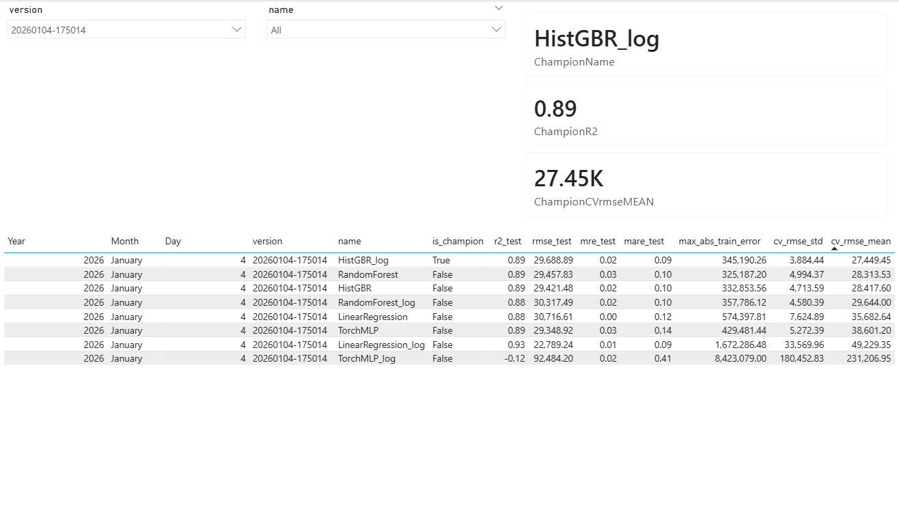

# House-Price-Model (Kaggle) – End-to-End ML + Data Engineering (Postgres, Flyway, Power BI)

Dieses Repo ist ein lokal reproduzierbares End-to-End Projekt rund um das Kaggle-Dataset **House Prices: Advanced Regression Techniques**.

Fokus:
- mehrere Modellfamilien (sklearn + PyTorch) sauber vergleichbar trainieren
- Modell-Runs + Metriken + OOF/CV-Predictions in **PostgreSQL** persistieren
- **Power BI** für Monitoring / Error Analytics (z.B. Price-Buckets, Worst Cases)
- DB-Struktur versioniert und reproduzierbar über **Flyway**

---

## TL;DR

- Lokales Default-Setup: Postgres 16 via Docker Compose
- DB-Schema: Flyway Migrationen unter `sql/migrations/`
- Training:
  - `python train.py` (train-only: Full-Data fit + Artefakt speichern + Run in DB loggen)
  - `python train.py --mode analysis` (gemeinsame CV-Splits, OOF-Predictions in DB, Champion per CV-RMSE)
- Prediction:
  - `python predict.py` (Champion laden, Kaggle-Predictions schreiben, optional in DB speichern)
- Power BI liest direkt aus der DB (`models`, `train_cv_predictions`, `predictions`)

---

## Projektstruktur

    .
    ├─ data/
    │  └─ raw/                      # train.csv / test.csv, nicht im Repo
    ├─ scripts/
    │  ├─ set_env_local_db.ps1
    │  ├─ set_env_azure_db_example.ps1
    │  ├─ set_env_azure_db.ps1      # lokal (Secrets), nicht im Repo
    │  ├─ test_db_connection.py
    │  └─ show_db_sample.py
    ├─ sql/
    │  └─ migrations/
    │     ├─ V1__init.sql
    │     └─ V2__align_legacy_schema.sql
    ├─ src/
    │  ├─ data.py
    │  ├─ db.py
    │  ├─ features.py
    │  ├─ preprocessing.py
    │  ├─ models.py
    │  └─ nn_models.py
    ├─ models/                      # .joblib Artefakte (lokal)
    ├─ predictions/                 # Kaggle CSVs (lokal)
    ├─ docker-compose.yml
    ├─ start_dev.ps1
    ├─ train.py
    └─ predict.py

---

## Daten

- Datensatz: Kaggle „House Prices: Advanced Regression Techniques“.
- Rohdaten (nicht im Repo):
  - `data/raw/train.csv`
  - `data/raw/test.csv`

Lokale Artefakte:
- `models/*.joblib` (gespeicherte Modelle)
- `predictions/*.csv` (Kaggle Submissions)
- `logs/`, `plots/` (optional)

---

## Datenbank (PostgreSQL)

### Tabellen / View

- `models`
  - Modell-Registry (Name, Version, Metriken, Hyperparameter/Metadata, Champion-Flag, created_at)
- `train_cv_predictions`
  - OOF/CV Predictions + Error-Spalten (für Bucket-Analysen in Power BI)
- `train_predictions`
  - optional: Fehler pro Train-Sample (Full-Train Fit; kann bei Overfitting-Checks helfen)
- `predictions`
  - Kaggle-Testset Predictions (optional, z.B. Champion)
- `v_predictions_with_model`
  - View: `predictions` ⨝ `models` (Reporting-Komfort)

### DB-Konfiguration (ENV)

Die Verbindung wird in `src/db.py` über ENV-Variablen gesteuert:

- `DB_HOST` – Hostname/FQDN (lokal: `localhost`)
- `DB_PORT` – Standard: `5432`
- `DB_NAME` – z.B. `house_prices`
- `DB_USER` – lokal: `house`
- `DB_PASSWORD` – lokal: `house`
- `DB_SSLMODE` – `"disable"` (lokal) oder `"require"` (Azure)

Die ENV-Variablen werden per PowerShell-Skripten gesetzt:
- lokal (Docker): `scripts/set_env_local_db.ps1`
- cloud (Azure): `scripts/set_env_azure_db.ps1` (nicht im Repo; Template: `*_example.ps1`)

---

## DB Schema Management (Flyway)

Das DB-Schema wird ausschließlich über Flyway verwaltet:

- Migrationen liegen unter `sql/migrations/`
- Flyway führt Migrationen in Reihenfolge aus und trackt den Stand in `flyway_schema_history`

Manuell ausführen:

    docker compose run --rm --no-deps flyway -connectRetries=60 migrate

### Legacy DB (wenn bereits Tabellen existieren)

Falls eine bestehende DB übernommen werden soll:

    docker compose run --rm --no-deps flyway -connectRetries=60 baseline -baselineVersion=1 -baselineDescription="baseline legacy schema"
    docker compose run --rm --no-deps flyway -connectRetries=60 migrate

Den aktuellen Stand prüfen:

    docker compose run --rm --no-deps flyway -connectRetries=60 info

---

## Setup (lokal)

Es gibt zwei Wege:

- **Automatisch (empfohlen):** ein Entry-Point (`start_dev.ps1`) setzt die komplette lokale Dev-Umgebung auf.
- **Manuell:** einzelne Schritte (venv, Docker DB, ENV, Flyway, Tests) – nützlich zum Debuggen

---

### Automatisch (empfohlen): `start_dev.ps1`

    .\start_dev.ps1

Was der Entry-Point macht (high level):
- aktiviert die Python-venv (falls vorhanden)
- startet die lokale PostgreSQL-DB via Docker Compose (persistentes Volume)
- setzt lokale DB-ENV-Variablen (`scripts/set_env_local_db.ps1`)
- führt Flyway Migrationen aus (`sql/migrations`)
- prüft die DB-Verbindung (`python -m scripts.test_db_connection`)

Optional: DB-Sample anzeigen

    python -m scripts.show_db_sample --limit 5

---

### Manuelles Setup (Debug / granular)

#### 1) Python-Umgebung

    python -m venv .venv
    .\.venv\Scripts\Activate.ps1
    pip install -r requirements.txt

#### 2) Lokale DB starten

    docker compose up -d db

#### 3) DB-ENV setzen (lokal)

    . .\scripts\set_env_local_db.ps1

#### 4) Migrationen anwenden (Flyway)

    docker compose run --rm --no-deps flyway -connectRetries=60 migrate

#### 5) Verbindung testen

    python -m scripts.test_db_connection

---

### Optional: Azure (Artifact)

Der Azure-Teil ist optional und nicht erforderlich für lokale Runs.

1) Azure ENV setzen (lokal, nicht committen)

    . .\scripts\set_env_azure_db.ps1

2) Migrationen gegen Azure anwenden (Flyway Container, URL aus ENV)

    docker compose run --rm --no-deps `
      -e FLYWAY_URL="jdbc:postgresql://$($env:DB_HOST):$($env:DB_PORT)/$($env:DB_NAME)?sslmode=$($env:DB_SSLMODE)" `
      -e FLYWAY_USER="$($env:DB_USER)" `
      -e FLYWAY_PASSWORD="$($env:DB_PASSWORD)" `
      flyway -connectRetries=60 migrate

3) Verbindung testen

    python -m scripts.test_db_connection

---

## Training

### Modus 1: train-only (Default)

Trainiert alle konfigurierten Modelle auf Full-Data, speichert Artefakte in `models/` und loggt einen Run in `models`.

    python train.py

### Modus 2: analysis (CV/OOF + Power BI)

- gemeinsamer Holdout-Split + KFold-CV (gleiche Folds für alle Modelle in diesem Run)
- OOF-Predictions werden nach `train_cv_predictions` geschrieben
- Metriken werden nach `models` geschrieben
- Champion wird per CV-RMSE gesetzt und als Artefakt gespeichert

    python train.py --mode analysis

Hinweis zur Vergleichbarkeit:
- gleiche CV-Splits pro Run (für fairen Modellvergleich)
- OOF-Predictions sind die Basis für Bucket-/Outlier-Analysen

---

## Prediction (Kaggle Test)

Erzeugt Predictions fürs Kaggle-Testset (CSV unter `predictions/`), typischerweise mit dem aktuellen Champion:

    python predict.py

---

## Power BI (Monitoring & Error Analytics)

Der Power BI Report hängt direkt an der PostgreSQL-Datenbank und dient als „Monitoring Layer“ über den Trainingsruns.

**Datenbasis (DB):**
- `models`: Run-/Modell-Metadaten und Metriken (CV-RMSE, Test-RMSE, R², Champion-Flag, Version/Run)
- `train_cv_predictions`: Out-of-Fold Predictions inkl. Fehler-Spalten (Abs/Rel Error) für Analyse nach Segmenten (Price-Buckets)

**Ziel:**
- Modellvergleich pro Run (welches Modell generalisiert am besten? wie stabil ist die CV?)
- Fehleranalyse entlang von Preissegmenten (wo entstehen systematische Fehler? welche Buckets sind problematisch?)
- schnelles Identifizieren von Ausreißern/Worst Cases für Debugging (Feature Engineering, Outlier Handling)

### Dashboard – Overview

Diese Seite zeigt pro Run/Version die wichtigsten Modell-Metriken und markiert den aktuellen Champion. Der Fokus liegt auf der Vergleichbarkeit der Modelle innerhalb eines Runs.

### Error Analytics – Buckets & Absolute Errors

Hier werden die Out-of-Fold Fehler nach Price-Buckets aggregiert. Das ist bewusst OOF/CV-basiert (statt Train-Fit), damit die Visualisierung echte Generalisierungsfehler zeigt und nicht nur Overfitting-Noise.

---

## Azure (Artifact / optional)

Optionaler Cloud-Teil:
- Terraform für Azure PostgreSQL Flexible Server in `terraform/`
- ENV-Setup lokal über `scripts/set_env_azure_db.ps1` (nicht im Repo)

Hinweis:
- Cloud-Infrastruktur kann Kosten verursachen und ist für die lokale Ausführung nicht notwendig.

---

## Design Notes

- Trennung der Verantwortlichkeiten:
  - `sql/migrations/*` definiert DB-Struktur (Flyway)
  - `src/db.py` kapselt DB-Zugriffe (Insert/Update/Query)
  - `train.py` orchestriert Training / Evaluation / Logging
  - `src/preprocessing.py` und `src/features.py` kapseln Feature-/Preprocessing-Logik
- OOF/CV als Grundlage für BI:
  - Fehleranalysen auf echten OOF-Predictions sind aussagekräftiger als reine Train-Fit Errors

---

## Roadmap

- Feature Engineering / Data Engineering zur Verbesserung von CV-RMSE (insb. HistGBR_log & TorchMLP)
- TorchMLP stabilisieren (Outlier/Target-Transform Consistency, Regularisierung)
- Optional: CI Smoke-Test (DB up → flyway migrate → basic import/run check)

- Lakehouse / Cloud Data Platform Extension (Snowflake / Databricks / Microsoft Fabric)
  - Ziel: das Projekt so umbauen, dass es nicht nur lokal mit Postgres läuft, sondern auch in einem „typischen“ Analytics-/DE-Stack.
  - Schritt 1: Daten-Landing-Zone + Raw/Curated Layer
    - Kaggle CSVs als "raw" in einen objektbasierten Storage legen (z.B. ADLS/S3, je nach Plattform)
    - daraus einen "curated" Layer bauen (bereinigte Tabellen + standardisierte Types)
  - Schritt 2: Feature/Training-Datasets als wiederverwendbare Views/Tabellen
    - Feature-Dataset als Tabelle/View materialisieren (statt ad-hoc im Training)
    - klare Versionierung: Dataset-Version ↔ Model-Run (Lineage)
  - Schritt 3: Reporting-Shift
    - Power BI direkt auf Snowflake/Databricks/Fabric Semantic Layer anbinden
    - optional: Modell-Metriken und OOF-Errors als Delta/Lakehouse-Tabellen speichern (statt Postgres)
  - Schritt 4: Orchestrierung
    - Jobs/Pipelines (z.B. Databricks Jobs oder Fabric Data Pipelines) für: ingest → transform → train → publish metrics

---

## Troubleshooting

### Docker / DB

**DB startet nicht / Connection hängt**
- Prüfen ob Docker läuft:
  
      docker info

- Postgres Logs ansehen:

      docker logs house-price-postgres --tail 100

**DB ist stuck / full reset (Achtung: Datenverlust)**
- Docker Volume löschen:

      docker compose down -v
      docker compose up -d db

### Flyway

**Welche Migrationen sind aktiv / Stand prüfen**

    docker compose run --rm --no-deps flyway -connectRetries=60 info

**Migration failed / inkonsistenter History-State**
- Reparieren:

    docker compose run --rm --no-deps flyway -connectRetries=60 repair

- Danach erneut:

    docker compose run --rm --no-deps flyway -connectRetries=60 migrate

**Legacy DB: V1 soll nicht nochmal laufen**
- Einmalig baseline setzen, danach normal migrate:

    docker compose run --rm --no-deps flyway -connectRetries=60 baseline -baselineVersion=1 -baselineDescription="baseline legacy schema"
    docker compose run --rm --no-deps flyway -connectRetries=60 migrate

### Python

**Fehler wegen fehlender Packages**

    pip install -r requirements.txt

**Imports schlagen fehl / falsche venv aktiv**
- Sicherstellen, dass die venv aktiv ist:

    .\.venv\Scripts\Activate.ps1

- Dann erneut ausführen:

    python train.py --mode analysis

### Power BI

**Power BI zeigt keine neuen Runs**
- Prüfen, ob `train.py --mode analysis` wirklich Daten in `models` und `train_cv_predictions` geschrieben hat
- DB Sample anzeigen:

    python -m scripts.show_db_sample --limit 10
